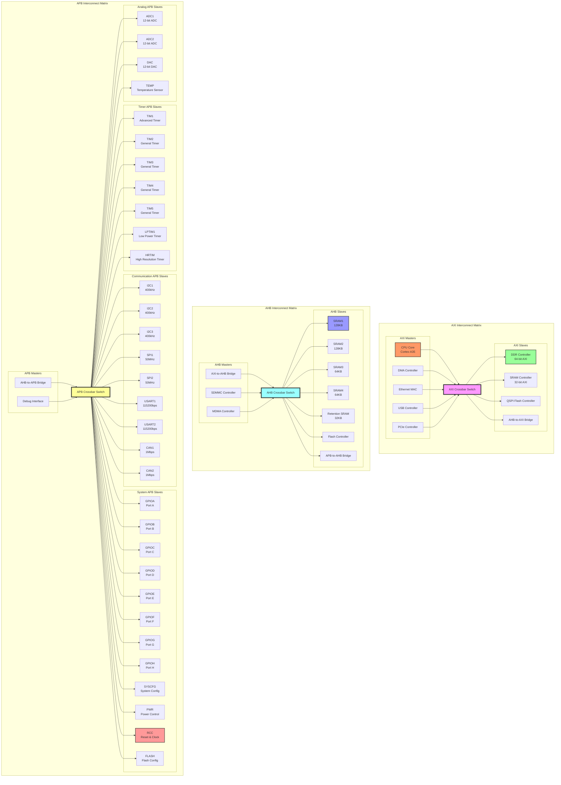

# SOC Bus Architecture - Mermaid Diagram

## Interactive Bus Interconnect Diagram



## Bus Performance Characteristics

| Bus Type | Data Width | Max Frequency | Throughput | Arbitration | Typical Use |
|----------|------------|---------------|------------|-------------|-------------|
| **AXI** | 64/128-bit | 1 GHz | 8-16 GB/s | Multi-layer | CPU, DMA, High-speed peripherals |
| **AHB** | 32/64-bit | 200 MHz | 800 MB/s-1.6 GB/s | Round-robin | SRAM, Flash, SDMMC |
| **APB** | 32-bit | 50 MHz | 200 MB/s | Single-master | Configuration registers |

## Bus Address Map (Simplified)

```
0x0000_0000 - 0x0FFF_FFFF : DDR Memory (256MB)
0x1000_0000 - 0x1FFF_FFFF : SRAM1-4, RETSRAM (512KB total)
0x2000_0000 - 0x2FFF_FFFF : Flash Memory (16MB)
0x4000_0000 - 0x4FFF_FFFF : APB Peripherals
  - 0x4000_0000 - 0x400F_FFFF : Timers
  - 0x4010_0000 - 0x401F_FFFF : Communication (I2C, SPI, USART, CAN)
  - 0x4020_0000 - 0x402F_FFFF : GPIO
  - 0x4030_0000 - 0x403F_FFFF : System (SYSCFG, PWR, RCC, FLASH)
  - 0x4040_0000 - 0x404F_FFFF : Analog (ADC, DAC, TEMP)
0x5000_0000 - 0x5FFF_FFFF : AHB Peripherals
0x6000_0000 - 0x6FFF_FFFF : QSPI Memory
0x7000_0000 - 0x7FFF_FFFF : System registers
```

## Key Architectural Features

### 1. **Hierarchical Bus Structure**
- **AXI**: High-performance system backbone
- **AHB**: Medium-performance peripheral bus  
- **APB**: Low-power configuration bus

### 2. **Bridge Architecture**
- AXI-to-AHB bridge enables seamless data transfer
- AHB-to-APB bridge provides register access
- Bridges handle protocol conversion and clock domain crossing

### 3. **Multi-Master Support**
- CPU, DMA, and peripherals can act as bus masters
- Arbitration ensures fair access and prevents conflicts
- Priority-based scheduling for real-time requirements

### 4. **Modular Design**
- Each peripheral type has dedicated bus segment
- Easy to add new masters/slaves without affecting existing connections
- Clean separation between high-speed and low-speed peripherals

### 5. **Performance Optimization**
- Separate buses for different performance classes
- Pipelined transactions on AXI for maximum throughput
- Burst transfers supported on AXI and AHB buses

This architecture provides a scalable, high-performance interconnect system suitable for complex SOC designs while maintaining low power consumption for battery-powered applications.